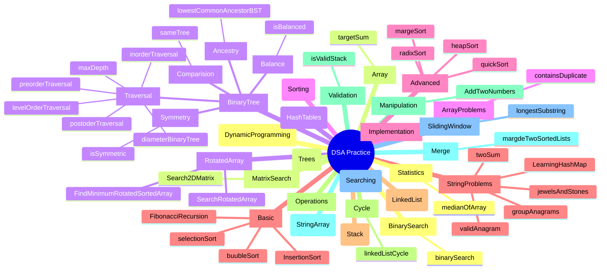

# AlgorithmIntro

This repository contains implementations and exercises for various Data Structures and Algorithms (DSA) topics. The structure follows a clear hierarchy explained below.

# AlgorithmIntro

This repository contains implementations and exercises for various Data Structures and Algorithms (DSA) topics. The structure follows a clear hierarchy explained below.

## Hierarchy Explanation

The repository follows a 4-level hierarchy:

1. **Main Topic** : The root of our DSA practice
2. **Categories** : Major algorithm/data structure domains
3. **Subcategories** : Specific problem types or implementation areas
4. **Exercises** : Individual problems and their solutions

## Technology Stack

All solutions are implemented in JavaScript, focusing on:

- Clean, readable code
- Detailed comments explaining the logic
- Multiple approaches when applicable
- Time and space complexity analysis

## Learning Progress

This repository represents my ongoing journey in mastering Data Structures and Algorithms. The learning process follows:

1. **Understanding the Concept**

   - Study the theoretical foundation
   - Analyze time and space complexities
   - Research common patterns and use cases

2. **Implementation Practice**

   - Solve problems incrementally
   - Start with brute force solutions
   - Optimize and refine approaches
   - Document learning insights

3. **Review and Improvement**
   - Regular revision of completed problems
   - Pattern recognition across similar problems
   - Continuous optimization of solutions

## LeetCode Profile

🔗 [My LeetCode Profile](https://leetcode.com/u/ramarm0825/)

Feel free to connect and follow my problem-solving journey!

## Progress Tracking

- [ ] Dynamic Programming
- [x] Hash Tables
- [ ] Linked Lists
- [x] Searching
- [ ] Sorting
- [ ] Stack
- [ ] String & Array

_Note: This is a living repository that's updated as I continue my DSA learning journey._
