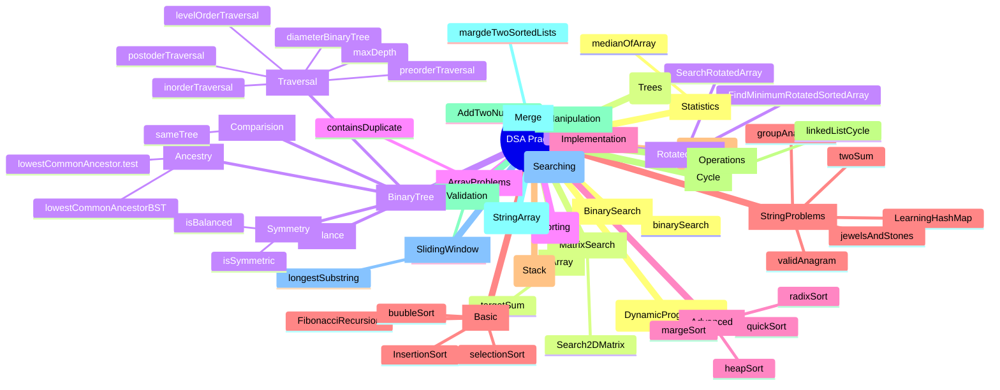

# AlgorithmIntro

This repository contains implementations and exercises for various Data Structures and Algorithms (DSA) topics. The structure follows a clear hierarchy explained below.

# AlgorithmIntro

This repository contains implementations and exercises for various Data Structures and Algorithms (DSA) topics. The structure follows a clear hierarchy explained below.

# AlgorithmIntro

This repository contains implementations and exercises for various Data Structures and Algorithms (DSA) topics. The structure follows a clear hierarchy explained below.

## Hierarchy Explanation

The repository follows a 4-level hierarchy:

1. **Main Topic** : The root of our DSA practice
2. **Categories** : Major algorithm/data structure domains
3. **Subcategories** : Specific problem types or implementation areas
4. **Exercises** : Individual problems and their solutions

## Technology Stack

All solutions are implemented in JavaScript with Vitest for unit testing, focusing on:

- Clean, readable code
- Comprehensive test coverage
- Detailed comments explaining the logic
- Multiple approaches when applicable
- Time and space complexity analysis

## Learning Progress

My learning process follows a linear progression through different data structures and algorithms:

1. **Concept Progression**
   I work through one concept at a time,
   starting with fundamental structures like arrays and advancing to more complex ones.
   For each concept, I focus on practical implementation and
   understanding patterns through problem-solving.

2. **Problem Selection**
   I select LeetCode problems that align with my current focus area.
   Each new problem builds upon my existing knowledge,
   creating a step-by-step learning path.

3. **Solution Development**
   When tackling problems:

   - If I'm familiar with the concept, I independently analyze inputs/outputs, identify edge cases, and document key insights before implementation
   - If it's newer territory, I work with Claude AI as an interviewer who asks guiding questions without providing direct answers
   - I prioritize understanding the problem thoroughly before coding

4. **Implementation Approach**
   My coding process typically involves:
   - Developing solutions based on pattern recognition
   - Implementing with attention to efficiency
   - Creating clean, well-documented code
   - Analyzing time/space complexity

## Testing Methodology

I use Vitest for unit testing to ensure code reliability and practice test-driven development:

1. **Unit Tests**

   - Test individual functions and components
   - Cover edge cases and normal scenarios
   - Practice test-driven development when appropriate

2. **Test Structure**

   - Organized by problem category
   - Clear test descriptions
   - Setup and teardown when needed
   - Coverage of edge cases

3. **Testing Goals**
   - Verify algorithm correctness
   - Document expected behavior
   - Practice testing techniques
   - Ensure maintainable solutions

## LeetCode Profile

🔗 [My LeetCode Profile](https://leetcode.com/u/ramarm0825/)

Feel free to connect and follow my problem-solving journey!

## Progress Tracking

- [ ] Dynamic Programming
- [x] Hash Tables
- [x] Linked Lists
- [x] Searching
- [x] Sorting
- [x] Stack
- [x] String & Array
- [ ] Trees & Binary Trees
- [ ] Graphs
- [ ] Greedy Algorithms
- [ ] Backtracking
- [ ] Advanced Dynamic Programming
- [ ] Bit Manipulation
- [ ] Design Problems

_Note: This is a living repository that's updated as I continue my DSA learning journey._
